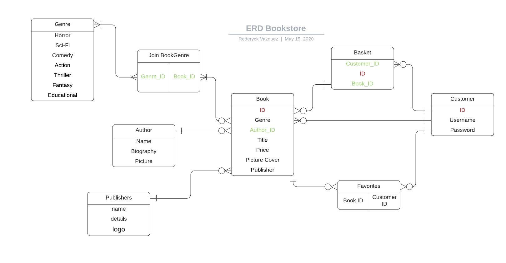

# README
# My 2 way market place template

Link to the deployed app: www.myapp.com 
Link to github repo: www.github.myrepo.com

## Section 1: Requirement checklist 

Each time you have completed a requirement check it off the list. This way it will be easy for the educators as well as yourselves to track your progress.

- [x] 1. Create your app using Ruby on Rails.
- [x] 2. Use Postgresql database in development and production.
- [x] 3. My app has authentication (eg. Devise).
- [x] 4. My app has authorisation (i.e. users have restrictions on what they can see and edit).
- [x] 5. My app has some type of file (eg. images) uploading capability.
- [x] 6. My app is deployed to Heroku (recommended) or AWS.
- [x] 7. I have identified the problem I am trying to solve by building this particular marketplace app.
- [] 8. I have explained why is it a problem that needs solving.
- [] 9. I have provided a link (URL) to my deployed app (i.e. website)---->https://bookstopia.herokuapp.com/books
- [] 10. I have provided a link to my GitHub repository (repo). I have ensured the repo is accessible by my Educators.
- [] 11. I have a complete description of my marketplace app (website), including:  
        - 11.1 Purpose  
        - 11.2 Functionality / features  
        - 11.3 Sitemap  
        - 11.4 Screenshots  
        - 11.5 Target audience  
        - 11.6 Tech stack (e.g. html, css, deployment platform, etc)  

- [ ] 12. I have provided user stories for my app
- [x] 13. I have provided Wire-Frames for my app 
- [ ] 14. I have provided an ERD for my app
- [ ] 15. I have explained the different high-level components (abstractions) in my app
- [ ] 16. I have listed and described any third party services that your app will use
- [ ] 17. I have described my projects models in terms of the relationships (active record associations) they have with each other.
- [ ] 18. I have discussed the database relations to be implemented in my application
- [ ] 19. I have provided my database schema design
- [ ] 20. I have described the way tasks are allocated and tracked in my project

NB Slide/Presentation specific requirements

- [ ] 21. An outline of the problem I solved by building this particular marketplace app, and why it’s a problem that needs solving.
- [ ] 22. A well planned walkthrough of my app
- [ ] 23. I have practived my presentation at least once and it is 5-6 minutes long. 

### Rubric Criteria

## Section 2: Documentation 
NB leave the Titles as they are and answer the questions below.

##### 1. Explain the different high-level components (abstractions) in your App.---------------------------------------------------------
* Includes a complete and detailed description of third party services used in the app

##### 2. List and describe any 3rd party services.
* Precisely explains and shows understanding of the different high-level components of the app

The Bookstopia app utilizes several third party services, namely Stripe, Amazon Web Services and Bulma. The creation of routes, methods, views and models are simply not sufficient to launch a scalable application, third party applications assists us in developing a more functional and scalable project. AWS serves as a data storage/ database since the Bookstopia allows for the upload of book images. Although a handful of images may not pose an issue for local databse, a scaled application will require a more robust database, as data uploads from multiple users may tally up beyond the local database capacity.

Stripe is a third party application which allows a business to receive payments when a request is sent to pay for a product. The stripe application  has a boilerplate form which allows for ease of attaching required information, as to what was purchased and whom purchased it. Stripe automatically calculates any neccessary mathematical operations and deducts the designated amount of a particular product. Once the transaction is complete stripe then sends back a confirmation post to notify as to whether or not it was successful. Availing of this service carries a surcharge for every transaction conducted with stripe.

Bulma is a styling application. This applicaiton is derived from the css and mainly utilizes the power of flexbox. Flexbox enables for the application to be dynamic as the objects within the page become responsive and scale according to the devise it is currently being viewed on. A key feature of Bulma are the pre-fabricated templates, which allows for convinient insertion of specific designs. This is accomplished mainly through the use of containers and classes. Although pre-made, Bulma designs can still be overwritten as per the users discretion, making designing flexible.

##### 3.1. Identify the problem you’re trying to solve by building this particular marketplace App?
* Demonstrates a full understanding of the problems that exist in a relevant marketplace that needs disrupting

In the current Australian economy especially post the Corona virus unemployment rates would have increased. Thousands of people will be under financial stress. These people may have unused books lying around, which they can easily monetize by posting it in a market place. Although certain books may not fetch a decent amount, it is still extra income which families may use for common household utilities. Some books may also have significant value to other indiviuals e.g. a university student requiring a certain text book, which can be costly, Bookstopia aims to reduce these prices and make books more accessible for everyone.

##### 3.2 Why is the problem identified a problem that needs solving?--------------------------------------------------------------
* Demonstrates a full understanding of the problems that exist in a relevant marketplace that needs disrupting

 Most online markets such as Ebay and gumtree contain broad range of products listings, which can be disrupt the attention of a potential book buyer. Listing priority is also monetized, which can push down other listings. Big markets also capitalize on individuals by charging fees and even comission based on a sale, leading to inflated prices which are then passed on to the end consumer.
 Bookstopia is aimed to create an online marketplace, where it focuses on selling both new and used books, but mainly focusing on the latter. By selling used books online Bookstopia can help in reducing waste, as unused books have the potential to be reused. Book prices may also be significantly lower as the middle man is eliminated, making books affordable. Some books may even be marked down at the discrecion of the seller due to slight cosmetic damage. The use of the application is also completely free, where all profits from a listing sale will go directly to the seller without charge of commision, allowing for extra income. The aim of keeping the application completely free is to encourage lower prices from private sellers. Bookstopia will be powered by minimal advertisements, to fund constant development.

##### 4. Describe your project’s models in terms of the relationships (active record associations) they have with each other.
* Complete discussion of the project’s models with an understanding of how its active record associations function

Being a two way market place the application requires users to be indentified. The users will be given specific values which can make individual users unique amongst others, this includes but is not limited to username/ email and password. These values can then be called upon in order to create particular sessions as well as querying parameters within the application to determine a particular users relationship with other objects. Since Bookstopia is an online bookstore a model must be crated to illustrate to the program what a book is. In this particular case a picture(book cover), author, publisher, price and genre is what a book is comprised of. The author, genre and publisher when examined, may repeatedly be used throughout the existence of multiple book listings. The details of these details may also have the potential of overscoping of what a book truely is, hence models for each values have been created. For simplicity author, genre and publisher were just assigned a cloumn/ value of name. Now everytime a user is logged in to create a book he/she is able to assign associations between the book and a particular author, genre and publisher, on top of the desired price and cover photo upload. Behind the scenes the associations are being created through the use of model relationship statements (e.g. has_many and has_one) and the use of tables with foreign keys. Every object made under a certain class instance receives a primary key, and it is when these primary keys are placed in another table other than itself does it become a foreign key, which binds two different data creating a relationship. A special case for the relationship between genre and book, since a book can have multiple genres. To adhere to the dry principle, a has_many through: relationship had to be utilized, and although not a direct relationship, the join table still makes use of foreign keys to create associations between the two models. 

##### 5. Discuss the database relations to be implemented.

* Provides coherent discussion of the database relations, with reference to the ERD

##### 6. Provide your database schema design.
* Flawless, complex, complete, and well thought through ERDs provided

##### 7. Provide User stories for your App.

* You also just use normal markdown to describe them
* User stories are well thought out, relevant, and comprehensively cover the needs of the app

 #### Layout
        To layout the foundation of the application after design the MVC had to be set up. The MVC and routing works together to assimilate code and create meaningful content for the user. The controllers were first established as it mediates the communication between the model and the view, via the CRUD restful API methods. URL links were then assigned for each specific method in the controller. The desired structure of the database tables along with relationships are then created in the model. To finalize and check as to whether or not these components are linked the view is lastly made to render data. The main views created for this application was to show a current book, view all book listings, view the current users listings, edit a listing and the main landing page.

#### Functionality
        Although the application is able to render data in plain view, user interaction is a crucial point in applications. A couple of functionality were added to enhance user experience and make a more dynamic application.
        A form was made to allow user to input specific details of a book they wish to sell, all predefined in the book model created earlier. This form also permitted the attachment of images which is linked to an external database AWS. This allows for larger data storage, which can assist in preventing the retardation of the application.

        The form also has the capability to detect unfilled parameters that are required and re-render the form and alert the user. Lastly the form was made so that it can accept multiple genres as most books would have. 

        A payment gem was also inserted "stripe" in the application.This gives the application the ability to send a link to a secure website, where transactions can be conducted. Major details of transactions such as validations, conversions and notification messages are inherently handled by the gem.

        Security and association of transactions are then installed through a gem named devise. This allows for the creation of unique identification for new and existing users, wherein all books created by that user is associated with that user's ID, and more inportantly when they proceed any payments, that the transaction is linked to their account.
 #### Design
        Design wise the application used the Bulma format. Bulma makes use of flexbox css along with premade classes, which can be assigned to objects in the code. This type of inheritance allows for responsive design, wherein the view of application automatically responds to dynamic views of the users device may it be a laptop, mobile phone or tablet. This allows the application to have more better design, smooth flow 
 #### Extras

##### 8. Provide Wireframes for your App.
 
  
 

    
    

   
    
     

 
* More than five detailed and well designed wireframes provided, for several different screen sizes (as required for the app)

##### 9. Describe the way tasks are planned and tracked in your project.

* Shows significant planning for how tasks are planned and tracked, including a full description of the process and of the tools used

##### 10. ERD provided represents a normalised database model.

* Meets D with no duplication and ideal definition of entities.

## Section 3: Code specific assessment. 

This section can be deleted from the readme. I have only included it here to draw your attention to it. 

LOL^^^^^^^^^^^^^^^^^^^^^^^^^^^^^^^^^^^^^^^^^^^^^^^^^^^^^^^^^^^^^^^^^LOL^^^^^^^^^^^^^^^^^^^^^^^^^^^^^^^

##### 11. Model implementation represents a normalised database model.
* Meets D with no duplication and ideal model implementation.

##### 12. Model implementation represents a normalised database model.
* Meets D and represents a highly optimised solution.

##### 13. Implemented controllers demonstrate correct use of commands to query the database infrastructure.
* Meets D and does so elegantly (queries chosen are the most elegant to achieve the result).

##### 14. Queries implemented provide correct data for the given scenario.
* Meets CR and demonstrates exceptional understanding of database queries.

##### 15. Code comments demonstrate how the queries implemented correctly represent the database structure.
* Meets D and all comments are exceptionally written.

##### 16. Identify and use appropriate model methods.
* Identifies and uses appropriate model methods for querying on self and its relationships, extends models scope where appropriate

##### 17. Minimising database calls needed to perform an action.
* Minimise all database calls and implement eager loading where appropriate

##### 18. Sanitise and validates input to maintain data integrity.
* Validates and sanitises all input

